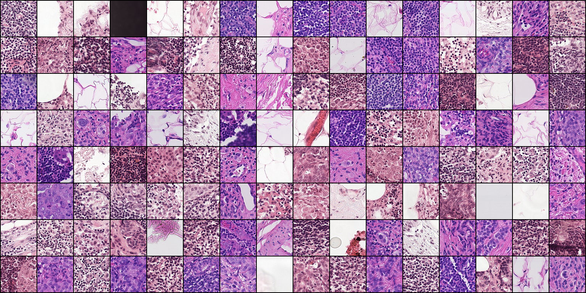
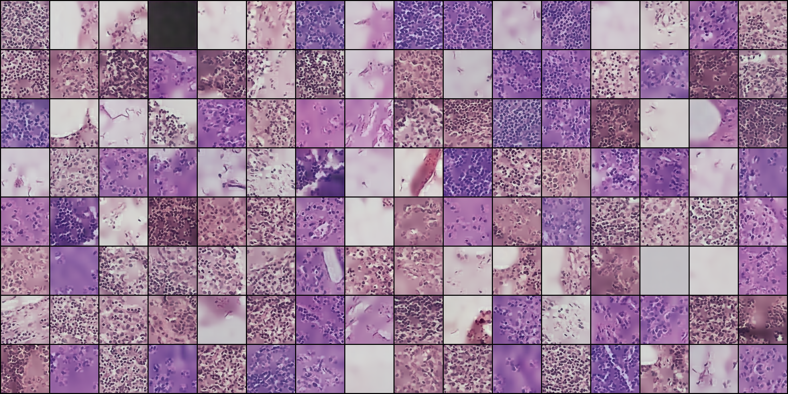
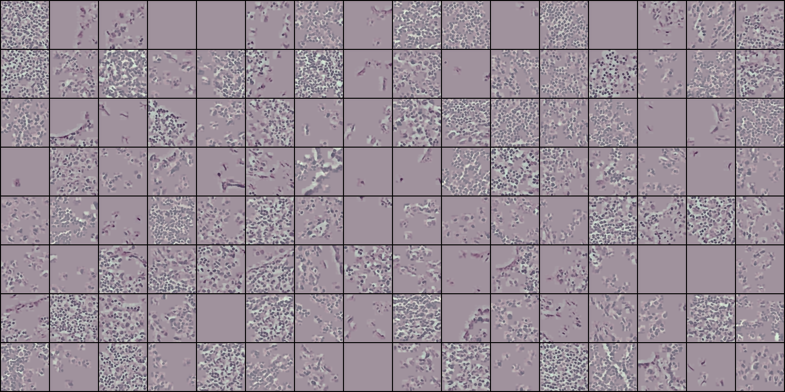
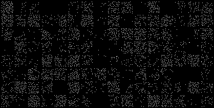
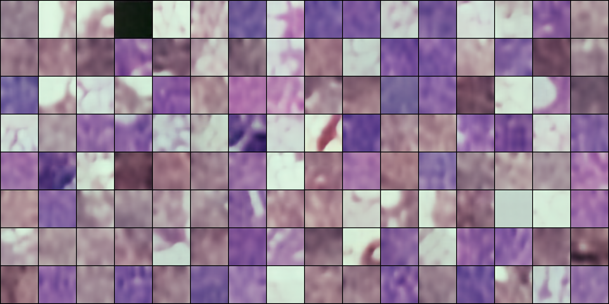

# Crosswise Sparse Autoencoder

[Paper](https://www3.cs.stonybrook.edu/~cvl/content/papers/2018/Le_PR19.pdf)

# Results on validation patches of PatchCamelyon

### Input

### Reconstruction 

### Foreground

### Detection map

### Background

